# Website Khóa Học React 

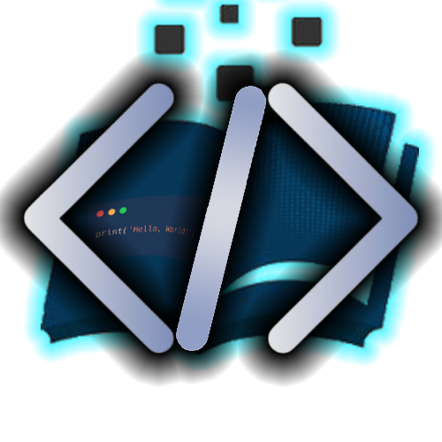

📅 **Thời gian**: 12/2024 - 02/2025  
🛠 **Công nghệ**: ReactJS, TailwindCSS, NodeJS, MongoDB  

## 🚀 Mô tả dự án  
Website Khóa Học React là nền tảng học tập trực tuyến toàn diện, hoàn toàn miễn phí, được thiết kế để hỗ trợ người dùng làm chủ ReactJS một cách hiệu quả. Hệ thống cung cấp:

- Kho video bài giảng chất lượng cao và bài tập  tương tác khi xem bài học
- Hệ thống theo dõi tiến độ thông minh và cấp chứng chỉ hoàn thành
- Bảng xếp hạng cạnh tranh, thúc đẩy tinh thần học tập
- Blog chia sẻ kiến thức, tips và tricks về React
- Xây dựng thời khóa biểu linh hoạt theo từng cấp độ người học
- Giao diện song ngữ Anh-Việt với chế độ sáng/tối linh hoạt

Website được xây dựng với trọng tâm là trải nghiệm người dùng, giúp việc học React trở nên dễ dàng và thú vị hơn.

## 🎯Các chức năng chính

✅ **Hệ thống học tập toàn diện**:  
- Cho phép người dùng chọn khóa học, xem video, làm bài tập và theo dõi tiến độ cá nhân.  

✅ **Hệ thống quản trị mạnh mẽ**:  
- Xây dựng giao diện trực quan cho quản trị viên để quản lý khóa học, bài giảng và bài tập.  

✅ **Tích hợp AI Chatbot**:  
- Hỗ trợ giải đáp thắc mắc, tóm tắt nội dung bài học và tạo bài tập thêm dựa trên bài học hiện tại  

✅ **Tối ưu hiệu suất & UX/UI**:  
- Áp dụng Lazy Loading & Optimaze Render giúp giảm **30% thời gian tải trang** và chỉ render các trang cần thiết .  

## 🖼️ Giao diện thực tế

### 🏠 Trang chủ
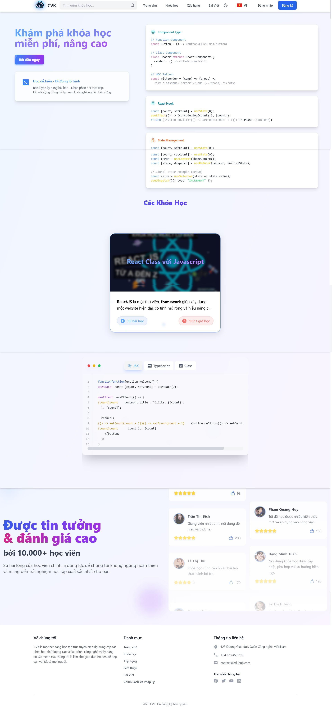

- Header với navigation và chức năng tìm kiếm
- Banner giới thiệu khóa học nổi bật
- Các đánh giá từ người học

### 📚 Trang khóa học
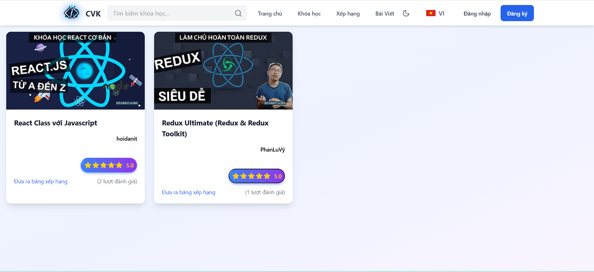

- Grid layout hiển thị khóa học với thumbnail
- Thông tin chi tiết số lượng người đánh giá khóa học và được phép đánh giá nếu học trên 70% tiến độ học

### 📖 Chi tiết khóa học
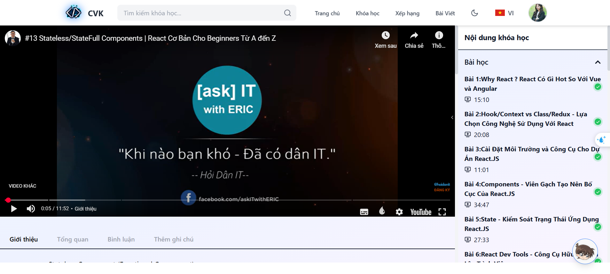

- Video khóa học
- Mục lục bài giảng
- Thông tin giảng viên
- Thông tin về khóa học , bài học 

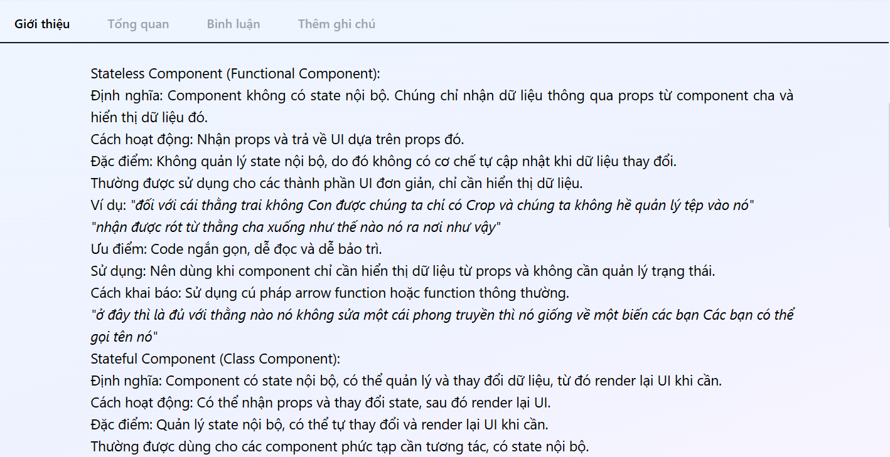

- Hiển thị câu hỏi trong quá trình học nhằm nâng cao bám sát nội dung bài học tránh gây nhàm chán

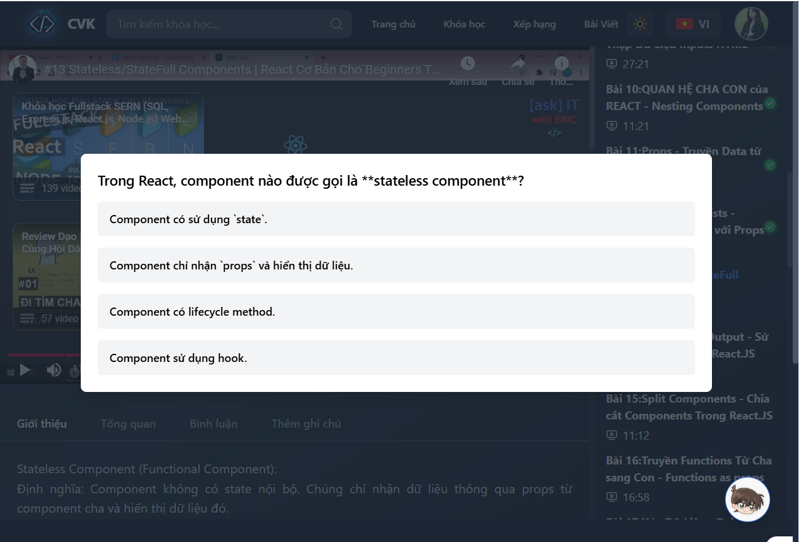

- Bình luận trao đổi , ghi chú note lại 

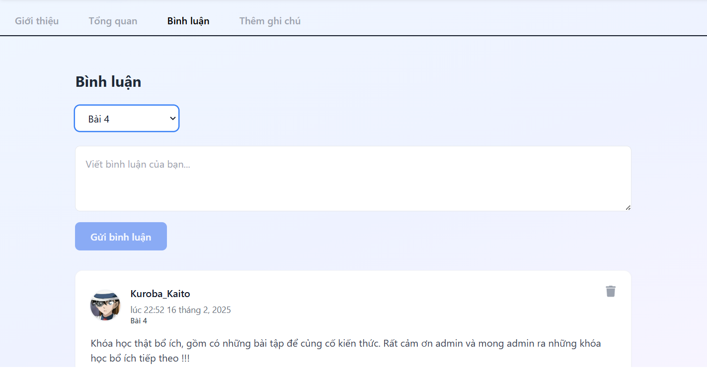

- Chatbot AI hỗ trợ tóm tắt nội dung và tạo bài tập bài học hiện tại . 

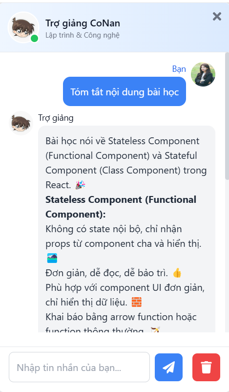

### 🏆 Bảng xếp hạng học viên

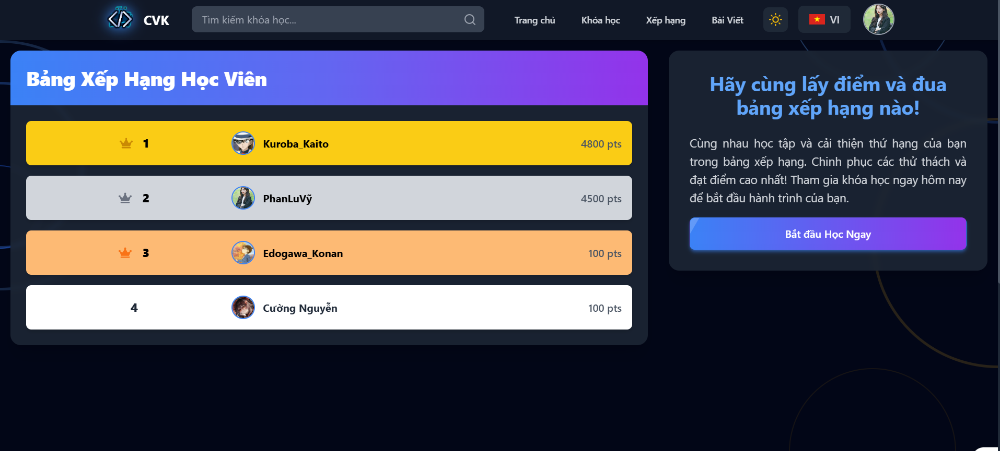

- Vinh danh top học viên xuất sắc với thành tích cao
- Hệ thống cấp huy hiệu và danh hiệu đặc biệt
- Thúc đẩy tinh thần học tập qua tính năng cạnh tranh
- Cập nhật thứ hạng real-time theo điểm số và hoạt động

### 📝 Blog kiến thức React

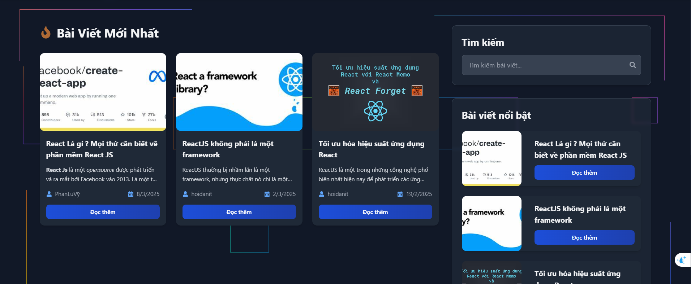

- Kho tàng bài viết chuyên sâu từ các chuyên gia React
- Nội dung được kiểm duyệt kỹ càng bởi đội ngũ admin
- Chia sẻ tips & tricks thiết thực cho ReactJS developer
- Cập nhật xu hướng và best practices mới nhất về React

### 📅 Trang lộ trình học cá nhân

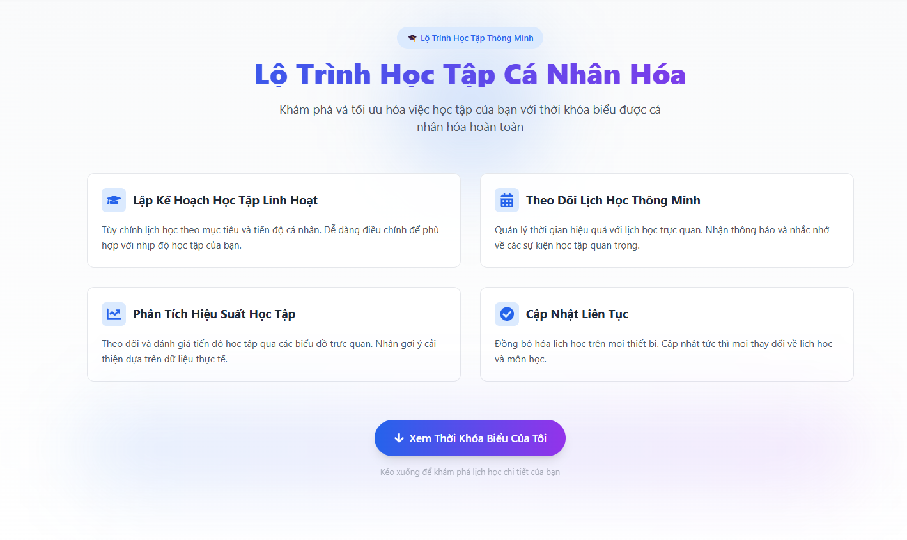

- Tính năng xây dựng lộ trình học tập được cá nhân hóa dựa trên:
    - Trình độ hiện tại của học viên
    - Thời gian có thể đầu tư
    - Khóa học quan tâm

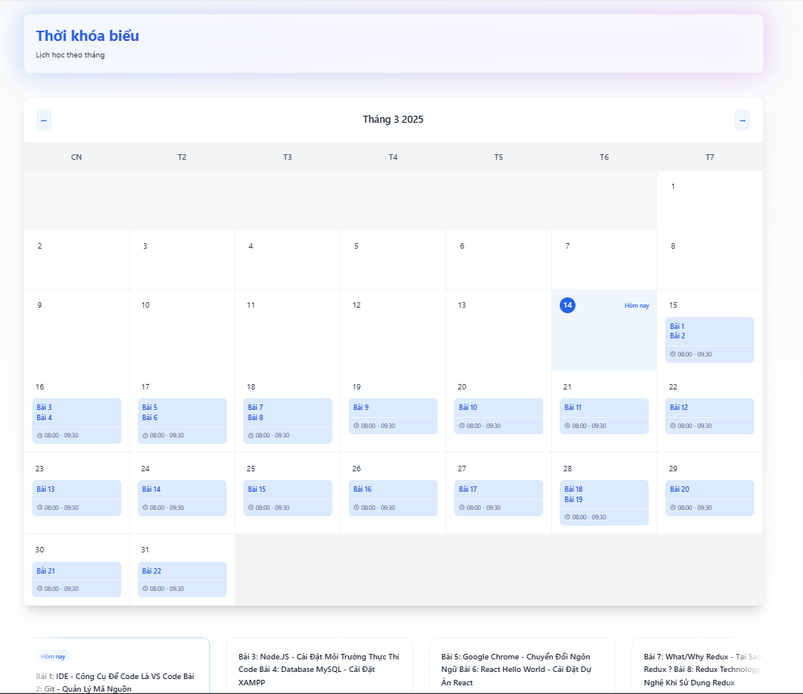

- Hệ thống tự động đề xuất thời khóa biểu tối ưu
- Điều chỉnh linh hoạt theo tiến độ và khả năng tiếp thu

## 📊 Kết quả & Ấn tượng  

✔️ Đạt **Giải Nhì Cuộc Thi Website Designer Challenge - 2025 tại ITC**.    
✔️ Chatbot AI hỗ trợ **80% câu hỏi thông dụng**, nâng cao trải nghiệm học tập.  
✔️ Tối ưu hiệu suất website, đạt điểm cao trên **Google PageSpeed Insights**:  
   - 🚀 **Performance**: 94  
   - 🌍 **Accessibility**: 87  
   - 🔥 **Best Practices**: 96  
   - 📈 **SEO**: 92  

## 📌 Công nghệ chi tiết dự án 

### Frontend
- **React** (v18.3) - Thư viện UI chính
- **TailwindCSS** (v3.4) - Framework CSS
- **React Router DOM** - Routing
- **Chart.js & Recharts** - Hiển thị biểu đồ và thống kê
- **i18next** - Hỗ trợ đa ngôn ngữ
- **Framer Motion** - Animation và hiệu ứng chuyển động

### Backend
- **Node.js & Express** - RESTful API và server framework
- **MongoDB & Mongoose** - Cơ sở dữ liệu NoSQL và ODM
- **JWT & Bcrypt** - Xác thực và mã hóa
- **AI Integration**:
    - Gemini 1.5 Pro - Mô hình ngôn ngữ AI
    - Langchain - Framework xử lý ngôn ngữ tự nhiên
    - Pinecone - Vector database
    - Multilingual-E5-Small - Embedding model  đa ngôn ngữ
- **Nodemailer** - Dịch vụ gửi email tự động

---
## 👥 Thành viên thực hiện
1. **Phan Lu Vỹ** - Leader
    - Email: planluvy14102005@gmail.com
    - GitHub: [github.com/vy-phan](https://github.com/vy-phan)
    
2. **Bùi Võ Văn Khoa** - Developer
    - GitHub: [github.com/BuiVoVanKhoa](https://github.com/BuiVoVanKhoa)

3. **Nguyễn Tuấn Cường** - Developer
    - GitHub: [github.com/CuongAFK](https://github.com/CuongAFK)

3. **Dương Trạch Đông** - Developer
    - GitHub: [github.com/DongDuong2005](https://github.com/DongDuong2005)

## 📌 Liên hệ & Tham khảo dự án  
🔗 **Demo**: [reactvck.onrender.com](https://reactvck.onrender.com/)
🔗 **Source Code**: [GitHub Repository](https://github.com/vy-phan/WebsiteReactVCK.git)

🚀 *Nếu bạn thấy dự án này hữu ích, hãy để lại ⭐ cho repo này nhé!*

## ⚖️ Legal Policy - Chính Sách Pháp Lý  

### 📜 Intellectual Property & Copyright Protection  
All content, including but not limited to code, design, images, text is the exclusive intellectual property of this project. Unauthorized reproduction, distribution, modification, or commercial use of any part of this project is strictly prohibited without prior written consent from the project owner.  

Any violation of intellectual property rights will be subject to legal actions under applicable copyright and intellectual property laws. If you wish to use any part of this project, please contact us for proper licensing or collaboration opportunities.  

### 📜 Bảo Vệ Bản Quyền & Sở Hữu Trí Tuệ 
Tất cả nội dung, bao gồm nhưng không giới hạn ở mã nguồn, thiết kế, hình ảnh, văn bản đều là tài sản trí tuệ độc quyền của dự án này. Nghiêm cấm sao chép, phân phối, chỉnh sửa hoặc sử dụng cho mục đích thương mại bất kỳ phần nào của dự án mà không có sự đồng ý bằng văn bản từ chủ sở hữu dự án.  

Mọi hành vi vi phạm quyền sở hữu trí tuệ sẽ bị xử lý theo quy định của pháp luật về bản quyền và sở hữu trí tuệ hiện hành. Nếu bạn muốn sử dụng bất kỳ phần nào của dự án, vui lòng liên hệ với chúng tôi để có được sự cấp phép hợp pháp hoặc hợp tác phù hợp.  
